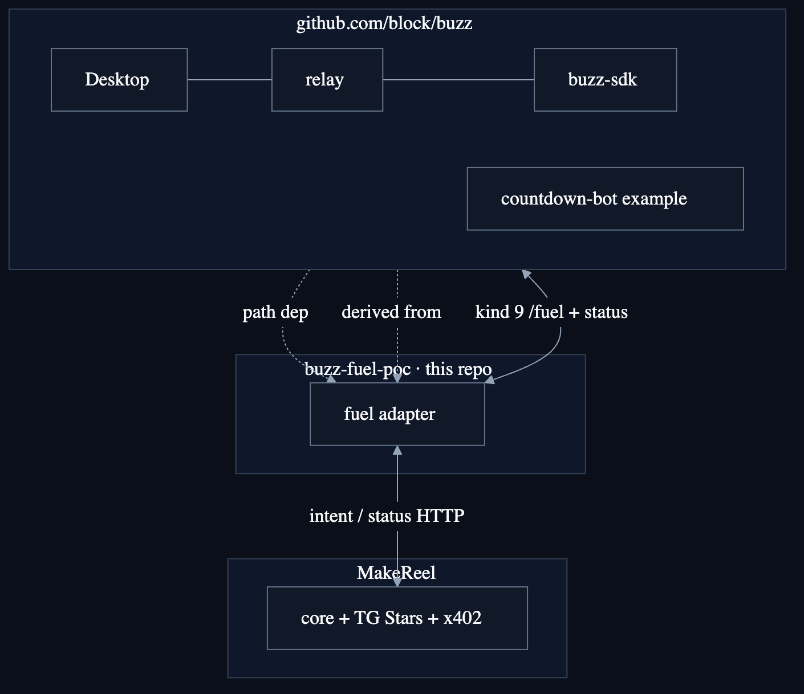
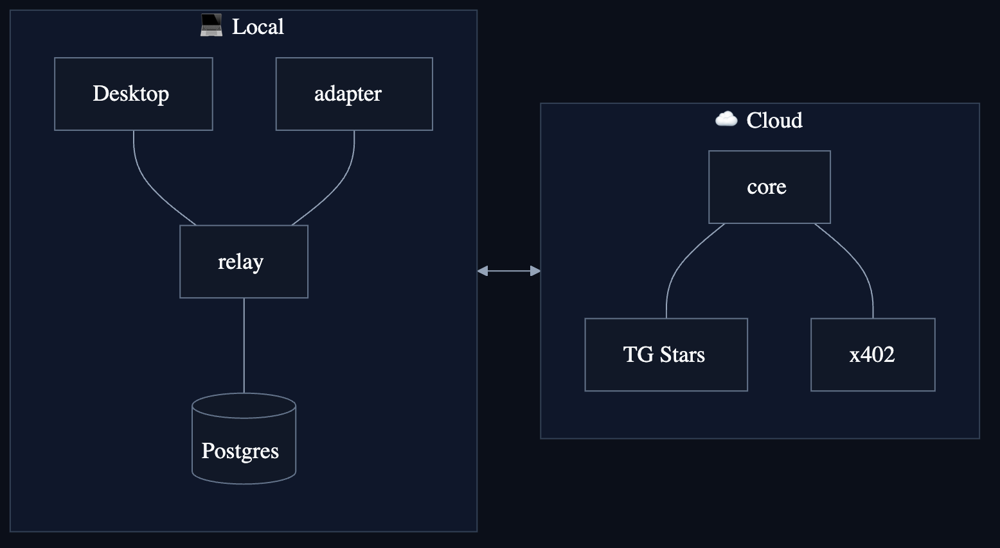
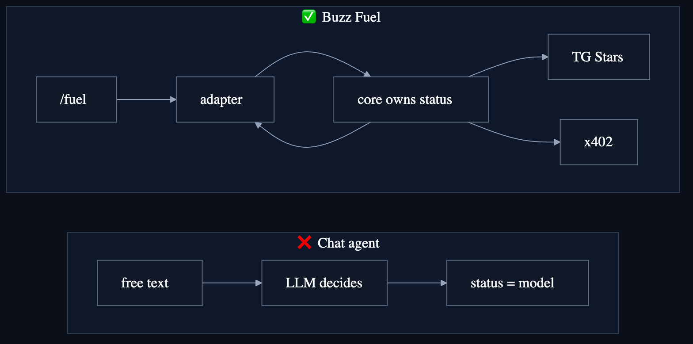
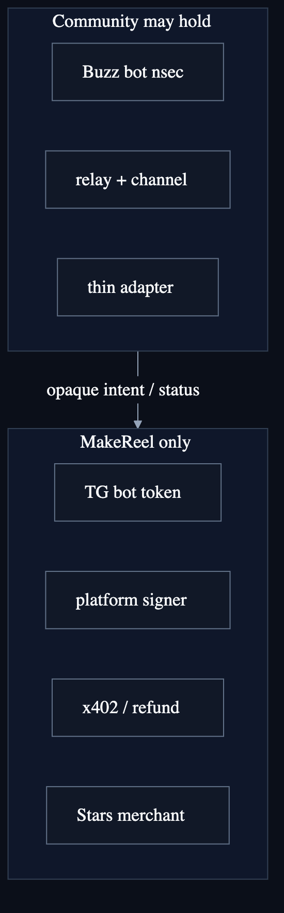
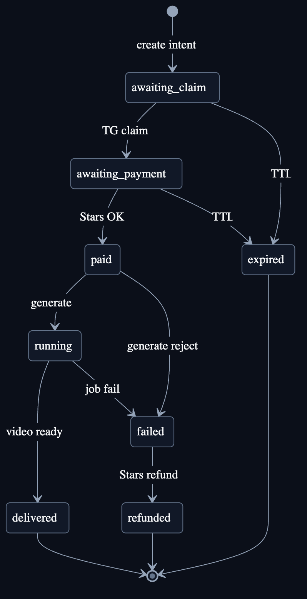
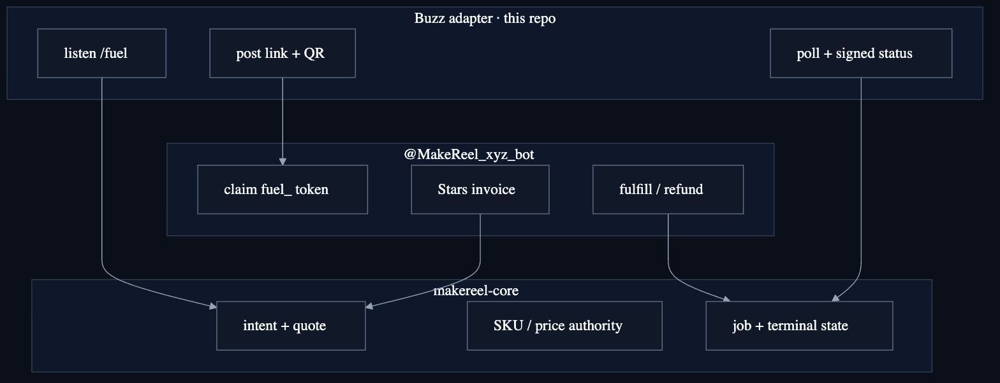
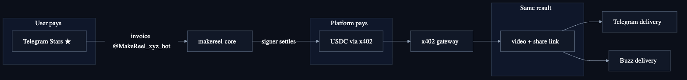
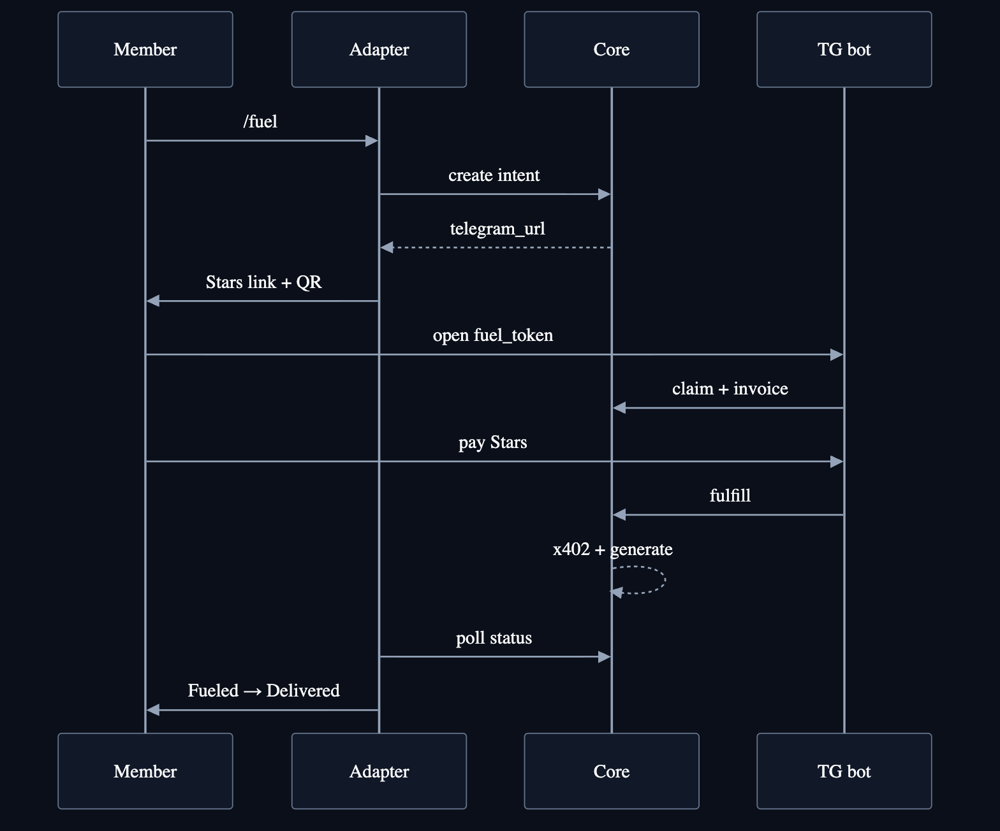

# Buzz Fuel POC

**Status:** reference experiment / not product-accepted for public self-service.  
**What this is:** a low-privilege **Buzz channel adapter** plus integration docs for  
`/fuel` → official `@MakeReel_xyz_bot` Stars → MakeReel core x402 → signed status back to Buzz.  
**What this is not:** the payment core, Telegram merchant bot, platform signer, or x402 gateway.

Open-source hygiene audit: [docs/16-OPEN-SOURCE-AND-DISTRIBUTION-AUDIT.md](./docs/16-OPEN-SOURCE-AND-DISTRIBUTION-AUDIT.md)  
Implementer handoff (redacted): [IMPLEMENTER-HANDOFF.md](./IMPLEMENTER-HANDOFF.md)

## Upstream: [Buzz](https://github.com/block/buzz)

This adapter lives **next to** Buzz — it is **not** a fork of Buzz and does not replace the product.

| | |
|---|---|
| Upstream | **[block/buzz](https://github.com/block/buzz)** |
| Tagline | A workspace where humans and agents build together, on a relay you own |
| Model | Self-hostable Nostr relay + signed events (kind 9 channel messages, NIP-42 auth, …) |
| License | Apache-2.0 |
| This POC uses | [`crates/buzz-sdk`](https://github.com/block/buzz/tree/main/crates/buzz-sdk) path dependency |
| Derived from | [`examples/countdown-bot`](https://github.com/block/buzz/tree/main/examples/countdown-bot) (see [NOTICE](./NOTICE)) |

**How they fit together**

```text
Buzz (block/buzz)
  Desktop / relay / channel room
       ↑ kind 9  /fuel
  buzz-fuel-poc adapter  ← this folder
       ↓ internal HTTP
  MakeReel core + @MakeReel_xyz_bot  (Stars + x402)
       ↓ status poll
  adapter posts Fueled / Delivered back into the same Buzz channel
```

- **Buzz owns** identity, channel membership, signed messages, local relay/Desktop UX.  
- **This POC owns** the thin `/fuel` bot glue only.  
- **MakeReel owns** Stars merchant, quote, x402 signer, generation, refund.  
- P0 does **not** modify Buzz upstream crates for product behavior; clone Buzz as a sibling for the SDK path (see build below).

Bootstrap pins a known-good Buzz commit via [`scripts/bootstrap-deps.sh`](./scripts/bootstrap-deps.sh) (`BUZZ_GIT_URL` defaults to `https://github.com/block/buzz.git`).

## Diagrams

Dark cards under [`diagrams/`](./diagrams/) (Mermaid source + PNG). Re-render: `bash diagrams/render.sh`.

### Upstream Buzz + this adapter

Buzz product: **[github.com/block/buzz](https://github.com/block/buzz)**. This folder only path-depends on `buzz-sdk` and mirrors the countdown-bot pattern.



### Local stack vs cloud payment core



### Not a free-form chat agent



### User journey


### Trust boundary



### Intent status machine (core-owned)



### Who owns which surface



### Two rails, one result



### Happy-path sequence



## One-line product contract

```text
Buzz /fuel
→ t.me/MakeReel_xyz_bot?start=fuel_<opaque-token>
→ canonical Telegram Stars invoice
→ existing MakeReel platform payer settles x402
→ the same result is delivered to Telegram and Buzz
```

## Build from a clean clone

This crate path-depends on the [Buzz SDK](https://github.com/block/buzz/tree/main/crates/buzz-sdk) from [block/buzz](https://github.com/block/buzz):

```toml
buzz-sdk = { path = "../buzz/crates/buzz-sdk" }
```

Expected layout:

```text
<parent>/
  buzz/                 # git clone https://github.com/block/buzz.git
  buzz-fuel-poc/        # this package
```

```bash
cd buzz-fuel-poc
bash scripts/bootstrap-deps.sh   # clones sibling block/buzz if missing
cargo test --locked
bash scripts/check-public-hygiene.sh
```

Optional pin override:

```bash
BUZZ_GIT_URL=https://github.com/block/buzz.git \
BUZZ_GIT_REV=<commit> \
  bash scripts/bootstrap-deps.sh
```

License: [LICENSE](./LICENSE) (Apache-2.0). Attribution for countdown-bot lineage: [NOTICE](./NOTICE).
## Configure (dev only)

```bash
cp .env.example .env
# fill BUZZ_* and MakeReel API settings — never commit .env
```

**Security note:** today’s adapter still uses a shared `INTERNAL_API_KEY` shape suitable for **operator-controlled** demos. Do **not** treat this as safe community self-service credentials. See the audit doc.

## Read in this order

1. [docs/00-DECISIONS.md](./docs/00-DECISIONS.md) — locked choices, open gates, non-goals.
2. [docs/01-SOURCE-MAP.md](./docs/01-SOURCE-MAP.md) — code to reuse and what not to copy.
3. [docs/02-IMPLEMENTATION-PLAN.md](./docs/02-IMPLEMENTATION-PLAN.md) — cross-repo change sets.
4. [docs/03-TEST-ACCEPTANCE.md](./docs/03-TEST-ACCEPTANCE.md) — test matrix and evidence.
5. [docs/04-RELEASE-RUNBOOK.md](./docs/04-RELEASE-RUNBOOK.md) — staged release and rollback.
6. [docs/08-PEER-REVIEW-CONVERGENCE.md](./docs/08-PEER-REVIEW-CONVERGENCE.md) — peer-review disposition.
7. Role prompts: [docs/05-IMPLEMENTER-PROMPT.md](./docs/05-IMPLEMENTER-PROMPT.md) or [docs/06-REVIEWER-PROMPT.md](./docs/06-REVIEWER-PROMPT.md).

Folder guardrails: [AGENTS.md](./AGENTS.md).

## Source-of-truth ownership

| Concern | Authority | P0 treatment |
|---|---|---|
| Telegram merchant and payment events | `makereel-tg-miniapp` + `makereel-core` | Extend behind a feature flag |
| Account, quote, Stars conversion, ledger, refund | `makereel-core` | Reuse; never duplicate here |
| x402 quote, settlement, job lifecycle | x402 gateway via MakeReel payer | Call unchanged |
| Buzz identity, NIP-42, kind 9 messages | **[block/buzz](https://github.com/block/buzz)** (`examples/countdown-bot`, `crates/buzz-sdk`) | Derive a small standalone adapter here; do not patch Buzz for P0 |
| POC coordination and docs | This folder | New |
## Checkout topology

```text
<parent>/
  buzz/                 # dependency (block/buzz)
  buzz-fuel-poc/        # this adapter + docs

<makereel-core-checkout>/
  api/                  # fuel intent orchestration

<makereel-tg-miniapp-checkout>/
  bot/                  # fuel_ deep links, Stars invoice, TG delivery
```

P0 must not modify Buzz upstream crates for product behavior, the x402 gateway, or the MakeReel Mini App web UI.

## Local commands (safe / no money)

```bash
# Adapter
cd buzz-fuel-poc
bash scripts/bootstrap-deps.sh
cargo test --locked

# Core (separate checkout)
cd <makereel-core-checkout>
uv run pytest tests/test_buzz_fuel.py -v

# Telegram bot (separate checkout)
cd <makereel-tg-miniapp-checkout>
uv run pytest tests/ -v

# Simulated C1-dry (no money)
export MAKEREEL_CORE_PATH=<makereel-core-checkout>
cd "$MAKEREEL_CORE_PATH"
uv run python <path-to>/buzz-fuel-poc/scripts/c1_dry_core_path.py
```

## What must stay out of git

- `.env`, private keys, `*.nsec`, bot tokens
- `evidence/` (live run packs, screenshots, charge correlation)
- Production Railway IDs, live share URLs, balances (use private ops notes)

`scripts/check-public-hygiene.sh` bans common foot-guns.

## Current state

- [x] Adapter + unit tests (`/fuel`, status copy, optional QR/Blossom)
- [x] Core / TG fuel unit tests (separate repos)
- [x] Simulated C1-dry path script
- [x] Open-source hygiene pass (LICENSE, lockfile, path scrub, bootstrap, CI template)
- [ ] Curated multi-community pilot security (per-install credentials, allowlists) — not this gate
- [ ] Public self-service distribution — not this gate
